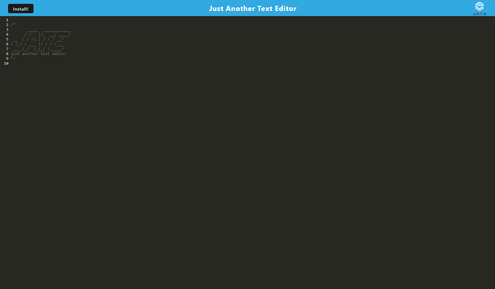

# text-editor

## Description

This simple application was made to showcase my ever-growing knowledge and skills of initializing and executing a service worker within the app, as well as updating/retrieving information within the database. The first hurdle was completing the method functions to export the updated data, as well as receiving all the content. I referenced the PWA class activities for the syntax. Next was installing, initializing and executing the service worker to clear cache. I found that again, reviewing the class activities really helped guide me through this. Finally, I had to adjust the webpack.config.js as well as the root package.json.

## Usage

[Deployed heroku text editor](https://just-another-text-ed-3011aaa576a8.herokuapp.com/)

To see the text editor at work, simply open the [text editor](https://just-another-text-ed-3011aaa576a8.herokuapp.com/) in your browser window. At the top left of the window, click the install button to initialize the install prompt. Hit 'ok' to install, and a separate browser window will pop up, the install completed. Happy Coding!

## License

MIT License

Copyright (c) 2023 Valerie Rojas

Permission is hereby granted, free of charge, to any person obtaining a copy of this software and associated documentation files (the "Software"), to deal in the Software without restriction, including without limitation the rights to use, copy, modify, merge, publish, distribute, sublicense, and/or sell copies of the Software, and to permit persons to whom the Software is furnished to do so, subject to the following conditions:

The above copyright notice and this permission notice shall be included in all copies or substantial portions of the Software.

THE SOFTWARE IS PROVIDED "AS IS", WITHOUT WARRANTY OF ANY KIND, EXPRESS OR IMPLIED, INCLUDING BUT NOT LIMITED TO THE WARRANTIES OF MERCHANTABILITY, FITNESS FOR A PARTICULAR PURPOSE AND NONINFRINGEMENT. IN NO EVENT SHALL THE AUTHORS OR COPYRIGHT HOLDERS BE LIABLE FOR ANY CLAIM, DAMAGES OR OTHER LIABILITY, WHETHER IN AN ACTION OF CONTRACT, TORT OR OTHERWISE, ARISING FROM, OUT OF OR IN CONNECTION WITH THE SOFTWARE OR THE USE OR OTHER DEALINGS IN THE SOFTWARE.